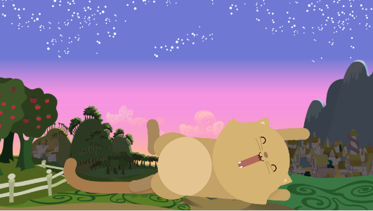

# Kitten

* **Track:** _Common Core_
* **Curso:** _Crea tu propia red social_
* **Unidad:** _La web desde un móvil_

***

El presente reto pone a prueba nuestros conocimientos **Grid System, Media Queries, viewport y responsive web design**

## Objetivo

El reto consiste en crear una página web donde se muestre un paisaje y un gatito diferente a medida que la ventana del navegador se haga más pequeña.

## Detalles adicionales

* Dentro del repositorio encontrarás un archivo index.html el cual contiene la estructura sobre la que se realizó el reto.
* En la carpeta css un archivo main.css donde está todos los estilos aplicados y el grid que se creó para este reto. Los cuales están enlazados con mi HTML.
* En assets también se encuentra la carpeta images donde se encuentran todos las imágenes usadas para completar este reto.
* Por último el README.md explicando el contenido de mi repositorio.
* Dentro de la rama **gh-pages** un link donde se podrá visualizar el resultado final.

## Autor

* Gabriela Mamani Flores.
